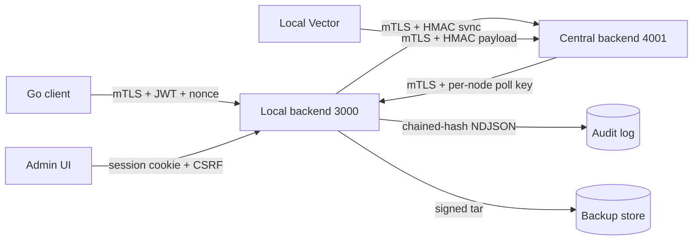

# Kế hoạch triển khai 13 cơ chế bảo mật bổ sung

## Phạm vi

Triển khai 13/15 mục từ phân tích trước, **bỏ mục 2** (key server `wg_key_server.py` không còn dùng) và **bỏ mục 4** (auth cục bộ cho `client/backend/client_app.js`).

Số thứ tự dưới đây bám đúng số gốc của bạn để dễ đối chiếu.

## Nguyên tắc chung

- Tất cả thay đổi phải **backward-compatible khi rollout**: bật cờ feature qua env (ví dụ `STRICT_AUTH=1`, `STRICT_TLS=1`) để có thể rollback nhanh.
- Không hard-code secret; mọi key/cert load từ env hoặc file `0600` thuộc root.
- Mỗi endpoint/luồng dữ liệu sau khi sửa phải có **một và chỉ một cơ chế xác thực rõ ràng** (admin session, device JWT, hay HMAC node-key) — không trộn lẫn.




---

# Giai đoạn 0 — Đóng bề mặt tấn công mở (P0)

Mục tiêu: ngăn chặn ngay khai thác từ LAN/peer nội bộ. Không chạm cơ chế xác thực mới — chỉ dán đúng middleware đã có vào endpoint còn thiếu, validate input, đóng CORS.

### Mục 3 — Đóng/auth-hóa các API quản trị mở trên local backend

Thêm middleware vào tất cả endpoint hiện đang mở trong [app/backend/app.js](app/backend/app.js) và các route con. Phân nhóm rõ "ai gọi":

- **Admin browser only** (gắn `requireAuth`):
  - `POST /api/interface`, `POST /api/add-interface`, `DELETE /api/delete-interface/:name`
  - `GET/POST /api/settings`, `POST /api/generate-keys`, `POST /api/configure-interface`
  - `POST /api/add-peer`, `POST /api/edit-peer/:index`, `DELETE /api/delete-peer/:index`, `POST /api/enable-peer/:index`, `POST /api/disable-peer/:index`
  - `POST /api/save-config`, `POST /api/reload-config`, `GET /api/config`
  - `POST /api/connect`, `POST /api/disconnect`
  - Toàn bộ [app/backend/routes/dashboard.js](app/backend/routes/dashboard.js) và [app/backend/routes/main_dashboard.js](app/backend/routes/main_dashboard.js).
- **Internal-only** (chuyển sang chỉ bind 127.0.0.1 hoặc bảo vệ bằng `x-register-key`):
  - `POST /api/sync-keys`, `POST /api/update-key` (xem mục 8 cho HMAC sau).
- **Endpoint công khai có chủ đích** (giữ nguyên nhưng siết): `GET /metrics` bắt buộc `POLL_API_KEY`, `GET /health`, `POST /api/admin-login`, `POST /api/login`, `POST /api/notifications/ingest`.

Tham chiếu mount hiện tại để biết vị trí chèn:

```1723:1726:app/backend/app.js
app.use('/api/dashboard', dashboardRoutes);
app.use('/api/main-dashboard', createMainDashboardRoutes({ mysql, dbConfig }));

app.use('/api', createAuthRoutes({ jwt, JWT_SECRET, mysql, dbConfig }));
```

Cách thực hiện: tạo middleware `requireAuth` ở mức router (ví dụ thêm `dashboardRoutes.use(requireAuth)` đầu file) thay vì sửa từng handler.

### Mục 13 — Strict input validation cho mọi tên dùng trong shell/systemd

Tạo helper `validators.js` ở `app/backend/`:

```javascript
const NAME_RE = /^[a-zA-Z0-9_-]{1,32}$/;
const IFACE_RE = /^[a-zA-Z0-9_]{1,15}$/;
function assertName(v) { if (!NAME_RE.test(String(v||''))) throw new Error('invalid name'); return v; }
function assertIface(v) { if (!IFACE_RE.test(String(v||''))) throw new Error('invalid interface'); return v; }
```

Áp dụng tại mọi điểm nội suy shell/systemd trong `app/backend/app.js` và `app/backend/routes/users.js`:

- `wg-quick up/down ${INTERFACE}`
- `systemd-run --unit=disable-${username}-${deviceName} ...`
- `wg syncconf ${IFACE} ...`
- `wg set ... peer ${pubkey}` (validate base64 32 bytes)
- Tất cả tham số dùng trong `execSync` cũng nên chuyển sang `spawnSync(cmd, [args], { shell: false })` khi khả thi.

Đồng thời sửa các script Python tương tự (`scripts/wg_key_renewal.py`, `scripts/wg_disable_peer.sh`): bỏ `shell=True`, dùng list args + regex check.

### Mục 14 — CORS whitelist origin

- `app/backend/app.js`: `app.use(cors())` → `app.use(cors({ origin: process.env.ALLOWED_ORIGINS?.split(',') || false, credentials: true }))`.
- Tương tự ở `central/backend/server.js`.
- Origin mặc định trỏ đến UI (ví dụ `https://<HOSTNAME>:3000`, `https://<central>:4001`).
- Khi UI và backend cùng origin (đúng setup hiện tại), có thể đặt `origin: false` để chỉ cho same-origin.

### Mục 1 (phần a) + Mục 15 (phần a) — Bật xác thực TLS ở mọi nơi đang `InsecureSkipVerify`

Bước này chỉ "bật verify với CA hệ thống / CA tự ký được tin", chưa làm mTLS đầy đủ (sẽ làm ở Giai đoạn 2).

Sửa các vị trí:

- [client_go/api.go](client_go/api.go) lines 13–17: bỏ `InsecureSkipVerify: true`. Thêm option load CA từ `/etc/wireguard/client/server-ca.pem` (hoặc system roots) vào `tls.Config.RootCAs`.
- [app/backend/centralSync.js](app/backend/centralSync.js) line 7: bỏ env `CENTRAL_NODE_TLS_INSECURE` (hoặc cho `=1` chỉ trong môi trường dev).
- [app/vector/vector.yaml](app/vector/vector.yaml): bỏ `verify_certificate: false` và `verify_hostname: false` ở cả 2 sink (`to_central_backend`, `to_local_backend`); thêm `ca_file: /etc/vector/certs/central-ca.pem`.
- [central/vector/vector.yaml](central/vector/vector.yaml): tương tự cho sink `to_notify_backend`.

Thêm task vận hành: phát hành CA root nội bộ và phân phối cert cho tất cả node + Vector + client_go.

---

# Giai đoạn 1 — Củng cố xác thực và chống replay (P1)

### Mục 5 — Rate limit + lockout + audit cho mọi login

- Thêm dependency `express-rate-limit` cho cả local và central.
- Áp lên `POST /api/admin-login` ([app/backend/app.js](app/backend/app.js#L1604)), `POST /api/login` device ([app/backend/routes/auth.js](app/backend/routes/auth.js#L8)), và `POST /api/login` central ([central/backend/server.js](central/backend/server.js)):
  - 10 request/phút/IP, trả 429.
- Lockout cấp account: lưu trong Redis `lockout:<username>` với TTL tăng dần (1 → 5 → 15 phút) sau mỗi 5 lần fail liên tiếp; reset khi login thành công.
- Mọi fail/lockout ghi audit qua `auditLogger.logAction('system', 'login_failed', {...})` và đẩy thành security event để Vector ship lên central.
- (Tùy chọn) thêm captcha (hCaptcha) khi vượt 3 lần fail.

### Mục 6 — CSRF + cookie hardening + bỏ secret hard-code

- Bỏ secret hard-code:
  - [app/backend/app.js](app/backend/app.js) line 33: `JWT_SECRET = process.env.JWT_SECRET` không fallback; nếu thiếu thì process exit khi start.
  - `session({ secret: 'wireguard-secret-key', ... })` → `process.env.SESSION_SECRET` (bắt buộc, độ dài ≥ 32 bytes).
  - [central/backend/centralAuth.js](central/backend/centralAuth.js) line 8: bỏ fallback `'change-central-jwt-secret'`.
  - Bỏ bootstrap `admin/admin` ở `ensureCredentials()` ([central/backend/centralAuth.js](central/backend/centralAuth.js#L10)) — buộc setup wizard sinh password ngẫu nhiên in ra console khi cài.
- Cookie hardening cho `express-session`: `cookie: { httpOnly: true, secure: true, sameSite: 'strict', maxAge: 3600000 }`.
- CSRF: thêm `csurf` middleware (hoặc double-submit token tự viết) cho mọi route admin có session cookie. UI gắn token vào header `X-CSRF-Token`.
- Bỏ MySQL hard-code `root/root` ([app/backend/app.js](app/backend/app.js#L26-L31)) → đọc từ env `WG_DB_USER`, `WG_DB_PASSWORD`.

### Mục 7 — JWT revocation list

- Thêm Redis key `revoked:<jti>` với TTL = thời gian còn lại của token.
- Sửa cấp JWT (cả [app/backend/routes/auth.js](app/backend/routes/auth.js#L36) và [central/backend/centralAuth.js](central/backend/centralAuth.js#L26)) để chèn `jti = randomUUID()`.
- `authenticateToken` middleware kiểm tra `await redis.exists('revoked:'+payload.jti)` → nếu có, 401.
- Các điểm gọi revoke:
  - Khi admin disable device (`POST /api/disable-device/:id` trong [app/backend/routes/users.js](app/backend/routes/users.js)) → revoke mọi JWT đang có của user/device đó (lookup theo `username:deviceName`).
  - Khi đổi password.
  - Khi xóa user/device.
  - Khi `/api/logout` (cả admin session và device JWT).

### Mục 8 — HMAC + nonce + timestamp cho mọi ingest/sync

Áp dụng cho 4 luồng:

1. **Local → Central**: `POST /api/register`, `POST /api/devices/sync`, `POST /api/devices/unsync`, `POST /api/logs/push` (xem [central/backend/server.js](central/backend/server.js#L461)).
2. **Central → Local**: `DELETE /api/sites/by-endpoint`, `DELETE /api/devices/by-machine/:machineId` (đang dùng `x-register-key`).
3. **Vector → Central** `to_central_backend`: chuyển từ static header sang HMAC trên payload (Vector remap thêm `signature` field).
4. **Local Vector → Local backend** `to_local_backend` (notifications/ingest).

Cơ chế:

- Mỗi node có cặp `node_id` + `node_secret` (hex 32 bytes) sinh khi register, lưu cả 2 phía.
- Header bổ sung: `X-Node-Id`, `X-Timestamp`, `X-Nonce`, `X-Signature: hmac_sha256(node_secret, "${method}\n${path}\n${timestamp}\n${nonce}\n${sha256(body)}")`.
- Server verify: `|now - timestamp| ≤ 5 phút`, nonce chưa thấy trong cửa sổ Redis `nonce:<node_id>:<nonce>` TTL 10 phút.
- Module dùng chung: `central/backend/hmacAuth.js` và `app/backend/hmacAuth.js`, expose `signRequest(...)` và `verifyMiddleware`.

Giải quyết luôn:

- Endpoint `POST /api/notifications/ingest` ở local + central: bắt buộc HMAC, bỏ chế độ "không set thì mở".
- Endpoint `/api/update-key` (peer rotate) ở local: HMAC bằng `node_secret` của peer site đối diện thay vì mở.

### Mục 11 — Secret hardening (DB / Redis / ClickHouse / .bashrc)

- MySQL: tạo user `wg_monitor_app` với grant tối thiểu thay cho `root`; mật khẩu lưu env, file `/etc/wireguard/secrets.env` mode `0600`.
- Redis: thêm `requirepass` trong `redis.conf`; cập nhật `redis.createClient({ url: 'redis://:'+process.env.REDIS_PASSWORD+'@127.0.0.1:6379' })` (xem [app/backend/deviceHeartbeat.js](app/backend/deviceHeartbeat.js)).
- ClickHouse: tạo user riêng cho central (`vpn_central`) thay user `default`/empty; cấu hình env `CLICKHOUSE_USER`, `CLICKHOUSE_PASSWORD`. Sửa `central/vector/vector.yaml` sink `to_clickhouse` (đang `user: default, password: root`).
- Thay cơ chế persist secret từ `~/.bashrc` (hàm `upsertBashrcEnv` ở [app/backend/app.js](app/backend/app.js#L106)) bằng file `/etc/wireguard/secrets.env` đọc qua `dotenv` khi khởi động dịch vụ; loại bỏ ghi vào `.bashrc`.
- Service systemd thêm `EnvironmentFile=/etc/wireguard/secrets.env`.

---

# Giai đoạn 2 — mTLS và toàn vẹn dữ liệu (P1/P2)

### Mục 1 (phần b) + Mục 15 (phần b) — Triển khai mTLS thật

Sau khi giai đoạn 0 đã verify cert phía client, giờ thêm xác thực phía server bằng client cert.

- **Local ↔ Central**:
  - Central server (`central/backend/server.js`) thêm `https.createServer({ key, cert, ca, requestCert: true, rejectUnauthorized: true })`.
  - Mỗi local node được cấp client cert có CN = `node-<id>`. Central dùng CN match với `node_id` đăng ký.
  - HTTPS agent ở [app/backend/centralSync.js](app/backend/centralSync.js) load `cert`, `key`, `ca` từ `/etc/wireguard/mtls/`.
  - HTTPS agent ở [central/backend/poller.js](central/backend/poller.js) load tương tự (cert client central) khi poll node.
- **client_go ↔ Local**:
  - Khi enroll, server local cấp client cert ngắn hạn (24h) ký bởi CA của hệ thống VPN, kèm WG public key của device.
  - `client_go` lưu cert/key tại `/etc/wireguard/client/` mode `0600`, gắn vào `tls.Config.Certificates` thay cho hiện tại.
  - Server local cấu hình `https.createServer({ requestCert: true, ca })` cho các route `/api/connect-vpn`, `/api/device-heartbeat`, `/api/disconnect-vpn`. JWT vẫn giữ — kết hợp 2 lớp.
- **Vector → Central**: cấu hình `tls.crt_file`, `tls.key_file`, `tls.ca_file` cho cả source `from_local` (đang chỉ TLS server) và sink `to_central_backend` để bật mutual TLS.

Triển khai theo trình tự: bật `requestCert: true, rejectUnauthorized: false` (chỉ log) trong 1 tuần để đo, sau đó set `true`.

### Mục 9 — Tamper-evident audit log

Sửa [app/backend/auditLogger.js](app/backend/auditLogger.js):

- Mỗi entry thêm `seq` (số tăng dần) + `prevHash` + `hmac`:
  - `hmac = HMAC_SHA256(audit_hmac_key, seq + prevHash + JSON.stringify({timestamp,admin,action,details}))`
  - `prevHash` = hash của entry liền trước.
- `audit_hmac_key` lấy từ `/etc/wireguard/secrets.env`, mode `0600`, **chỉ daemon đọc được**.
- `getLogs()` verify chuỗi khi đọc; nếu phát hiện đứt → đẩy security event đặc biệt `audit_chain_broken`.
- Đồng thời ship realtime sang central qua Vector (đã có); ở central lưu vào ClickHouse `wireguard_logs` với cùng chuỗi hash để cross-verify.
- Service systemd `wireguard_monitor.service` thêm `ReadWritePaths=/etc/wireguard/logs` và `ProtectSystem=strict` để giảm bề mặt ghi.

### Mục 10 — Ký số backup, verify trước khi restore

Sửa [app/backend/routes/backups.js](app/backend/routes/backups.js):

- Khi tạo backup (`POST /api/backups/create`):
  1. Tạo tarball + dump SQL như hiện tại.
  2. Tính `SHA256` của file.
  3. Ký bằng key Ed25519 của admin (lưu `/etc/wireguard/backup-sign.key` mode `0600`).
  4. Ghi file `.sig` đặt cạnh tarball.
- Khi restore (`POST /api/backups/restore`):
  1. Verify chữ ký `.sig` bằng public key tương ứng.
  2. Nếu fail → 400, log audit, không thực thi.
  3. Bắt buộc 2-step confirm (`?confirm=<token-1-time>` lấy từ request đầu tiên).
- Snapshot review (`GET /api/backups/snapshot/:name`) hiển thị fingerprint key đã ký.

---

# Giai đoạn 3 — Attestation phần cứng (P2)

### Mục 12 — Attestation thật cho client device

Thay `securityInfo` self-reported hiện tại ([client_go/security.go](client_go/security.go)) bằng challenge–response có chứng thực phần cứng.

- **Server side** (mới trong [app/backend/routes/users.js](app/backend/routes/users.js) hoặc file riêng `attestation.js`):
  - `GET /api/attestation/challenge` (yêu cầu JWT): trả `nonce` ngẫu nhiên 32 bytes, TTL 60s, gắn với `username:deviceName` trong Redis.
  - `POST /api/attestation/verify` (đã sửa từ heartbeat): nhận `{ nonce, signature, quote, securityInfo }`.
- **Client side** (`client_go`):
  - Lưu key Ed25519 của device trong TPM (qua `go-tpm` library) hoặc trong file `0600` nếu không có TPM (fallback có đánh dấu `attestation_level: software`).
  - Ký `nonce + machineId + securityInfo` bằng key TPM.
  - Nếu host có TPM 2.0: thêm TPM quote (`PCR0..7`) để chứng minh boot integrity.
- **Lifecycle**:
  - Khi enroll: client xuất `EK certificate` + public attestation key, server lưu vào DB cùng `device_id`.
  - Mỗi heartbeat: server verify chữ ký theo public key đã lưu, từ chối nếu nonce hết hạn / chữ ký sai → disconnect peer.
- **machineId chống forge**: thay vì đọc `/etc/machine-id`, derive từ TPM public key; server lưu hash của public key thay vì machine-id thô.

Mở rộng tự nhiên cùng giai đoạn này:

- Bind JWT với attestation public key (thêm `dpk` claim) để ngăn dùng JWT trên thiết bị khác.
- Refresh token rotation 12h, access token 1h — chỉ cấp khi attestation pass.

---

# Lộ trình rollout đề xuất

- Tuần 1: Giai đoạn 0 (mục 3, 13, 14, phần a của 1+15).
- Tuần 2–3: Giai đoạn 1 (mục 5, 6, 7, 8, 11).
- Tuần 4–5: Giai đoạn 2 (mục 1+15 phần b, 9, 10).
- Tuần 6+: Giai đoạn 3 (mục 12).

Mỗi mục có cờ env riêng để bật/tắt độc lập, cho phép rollback từng phần mà không ảnh hưởng các phần khác.